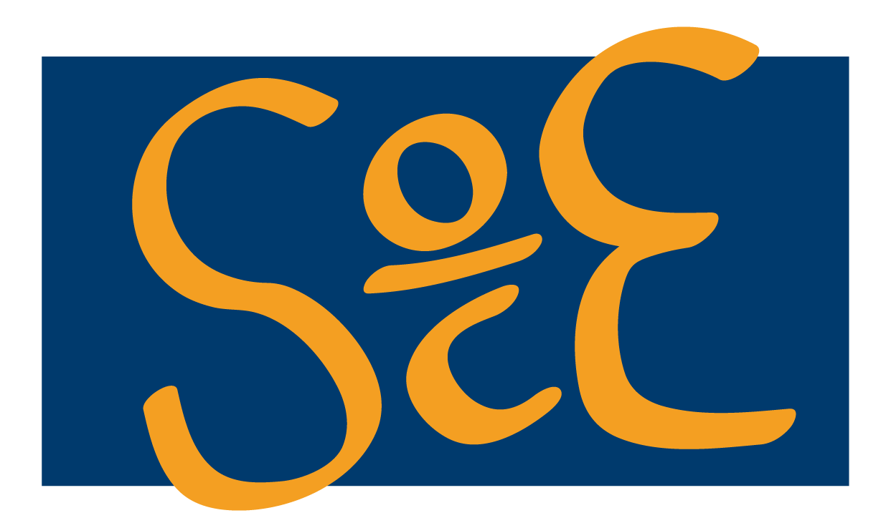

# Setmana de la ciència: el meu primer model predictiu 

Aquest és un repositori públic a l'abast de tots els assistents a l'activitat per a la divulgació estadística organitzada per la Societat Catalana d'Estadística (SOCE) a la Setmana de la Ciència, i de qualsevol persona que pugui estar interessada. En aquest repositori trobareu:

* Quatre arxius `.csv` que contenen quatre taules de dades. Les que acaben amb train es fan servir per entrenar models predictius, i les que acaben en test es fan servir per provar els models entrenats. 
* `models_predictius.Rmd`: en aquest arxiu podeu trobar el codi que per a analitzar les bases de dades. El llenguatge de programació usat és R. En els documents `models_predictius.pdf` i `models_predictius.html` trobareu aquest codi compilat i preparat per llegir i consultar.
* `setCiència_modelpred.pdf`: arxiu amb les transparències usades per a la presentació.
